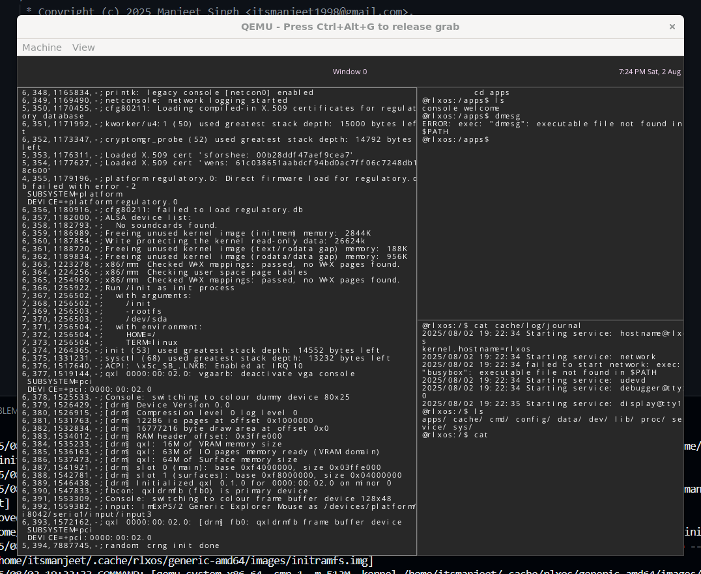

# 🐧 rlxos

**rlxos** is an experimental Linux distribution built **purely in Go**, without relying on the traditional **GNU/Linux stack**. It uses **direct syscalls** with CGO disabled (`CGO_ENABLED=0`).

> ⚠️ **Warning: Highly Experimental**
> This project is in a very early **proof-of-concept (POC)** stage. The codebase is **inefficient**, and there are **known memory and resource leaks**. Do **not** use this for anything other than **learning** or **experimentation**.



---

## 🚀 Motivation

The goal of `rlxos` is simple but ambitious:

* **Explore a new system stack** for Linux-based operating systems.
* **Understand how things work** by building a minimal OS environment using just Go and raw syscalls.
* Challenge conventional toolchains and eliminate dependency on C libraries and the GNU ecosystem.

---

## 📦 Requirements

To build and run `rlxos`, you'll need the following:

* [Go](https://go.dev) 1.24+

Install supporting packages:

```bash
sudo apt install build-essential rsync wget squashfs-tools flex bison bc qemu-system-x86 libssl-dev libelf-dev
```

---

## 🛠️ Getting Started

### 1. Clone the Repository

```bash
git clone https://github.com/itsmanjeet/rlxos.git
cd rlxos
```

### 2. Run Pre-check Script

```bash
./tools/checkup.sh
```

### 3. Build the OS Image

```bash
make DEVICE=generic-amd64
```

### 4. Run in QEMU

```bash
make DEVICE=generic-amd64 run
```

---

## 🧩 Adding New Commands

To add a new command in `rlxos`:

1. Create your command under the `./cmd/<Command-Name>` directory.
2. Register it by adding to one of the following:

   * **Global**: Add `cmd/<COMMAND-NAME>` to the `SYSTEM_TARGETS +=` line in the main `Makefile` or `./config.mk`.
   * **Device-specific**: Add it to the `SYSTEM_TARGETS +=` section in `./devices/<DEVICE>/config.mk`.

This helps keep builds modular and flexible.

---

## 📈 Current Progress & Roadmap

| Component             | Status       | Notes                                              |
| --------------------- | ------------ | -------------------------------------------------- |
| Init System           | ✅ Done       | Basic init process in place                        |
| Service Manager       | ✅ Done       | Simple supervision and service handling            |
| Shell                 | ⚙️ Basic      | Early prototype shell with minimal command support |
| Display Server        | ⚙️ Basic      | IPC support, shared memory for buffer exchange     |
| Graphic Framework     | ⚠️ Incomplete | Early scaffolding; work in progress                |
| Audio Framework       | ❌ Not Done   | No audio stack yet                                 |
| Networking Support    | ❌ Not Done   | No networking capabilities yet                     |
| DOOM Support          | ❌ Not Yet    | For fun—planned, but not started                   |
| Hardware Acceleration | ❌ Not Yet    | No GPU support; planned for future                 |

Stay tuned for more updates as development progresses.

---

## 💡 Notes

* All code is written in Go with `CGO_ENABLED=0`.
* No C dependencies or GNU toolchain components are used in the build.
* Expect bugs, crashes, and unexpected behavior—it’s all part of the learning journey.

---

## 📬 Get Involved

Have questions? Found a bug? Want to help?

* Open an issue
* Submit a pull request
* Start a discussion

This project is an educational journey. You're welcome to join in and contribute.

---

## 📜 License

This project is licensed under an GPLv3 license. See [LICENSE](./LICENSE) for details.
