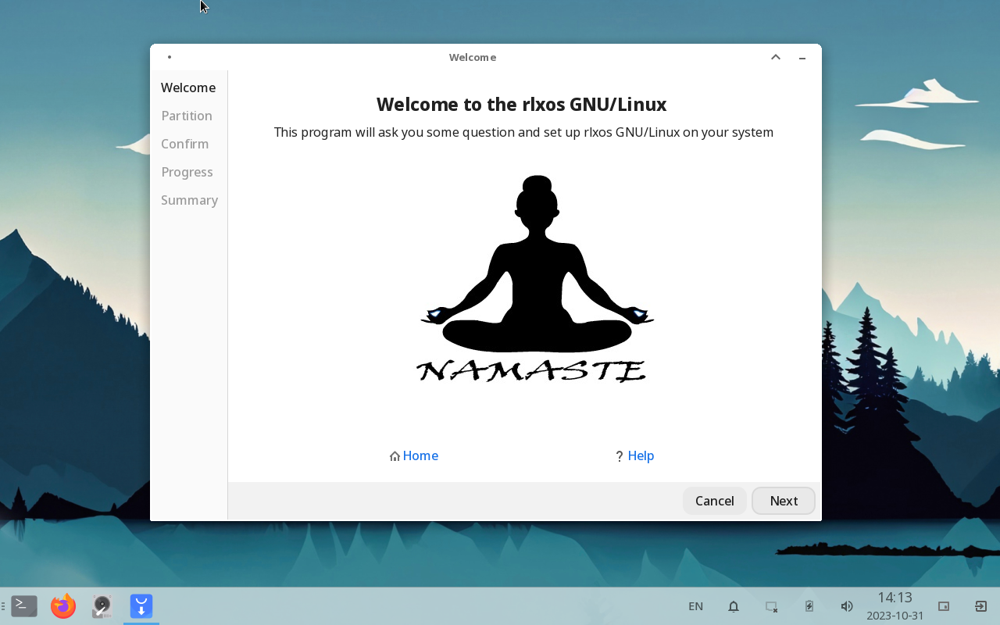
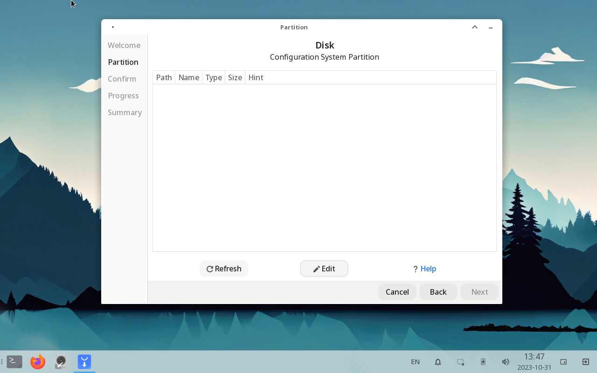
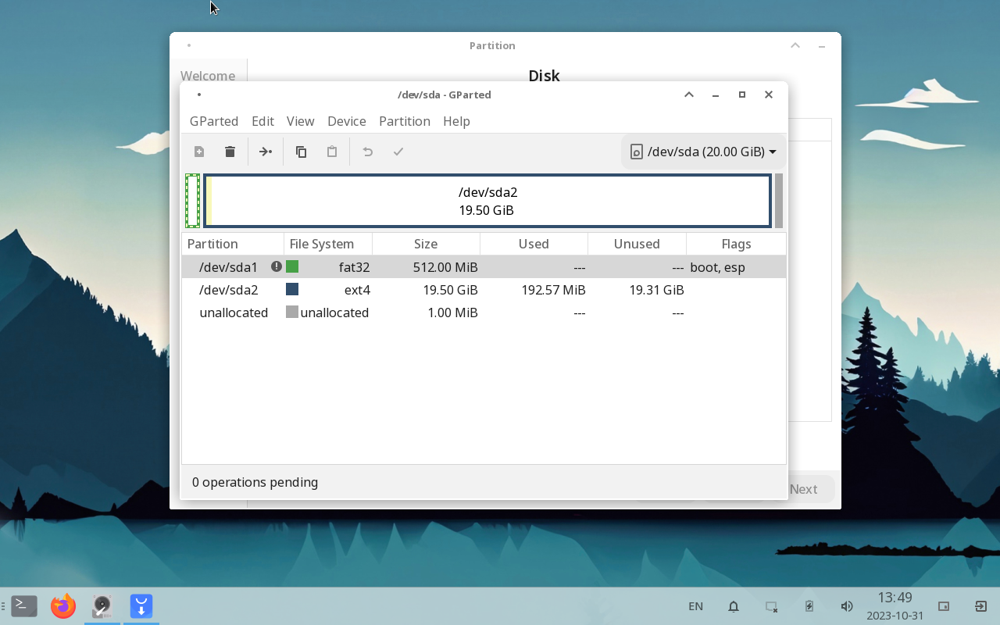
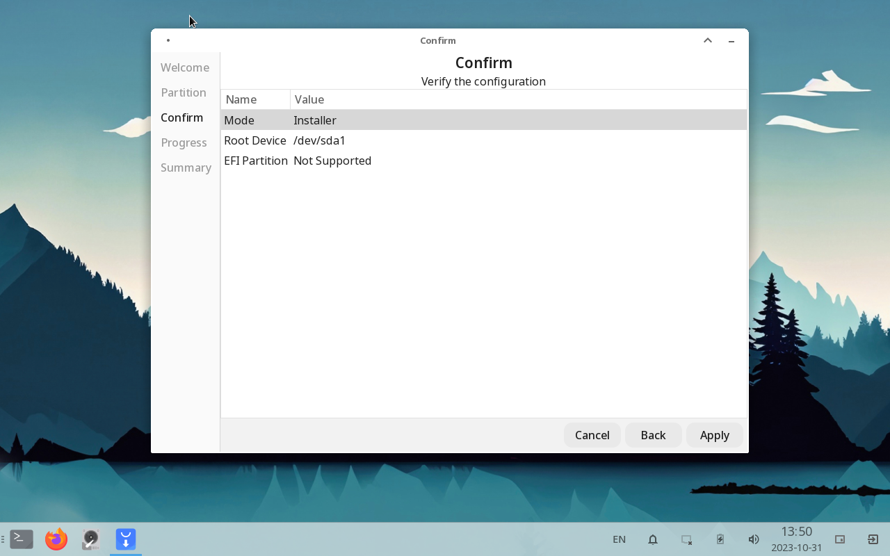
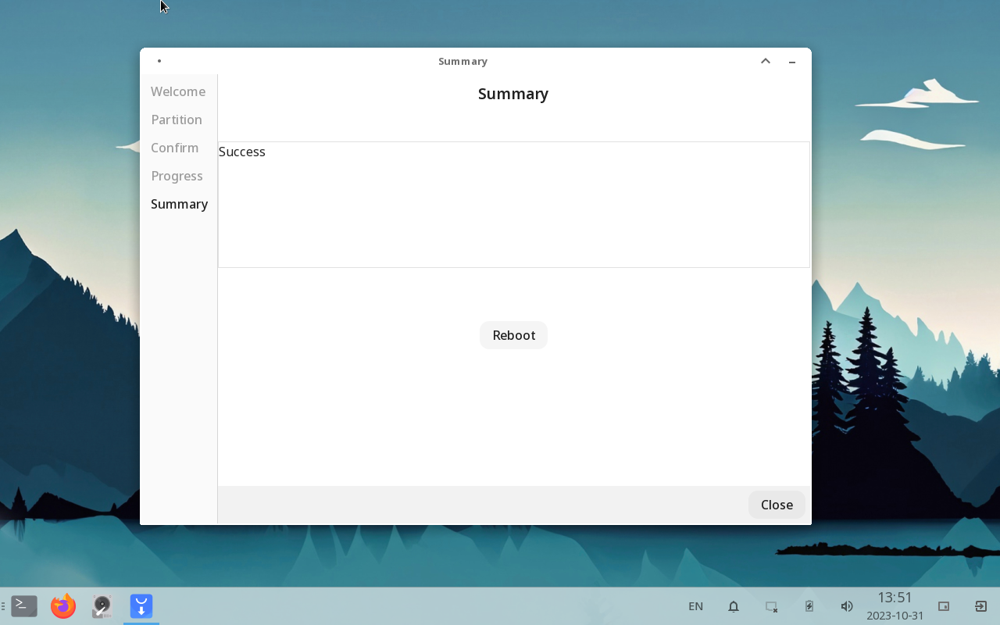

# Installating RLXOS

## Supported Hardware/Requirements

- CPU: Intel/AMD with x86_64 Architecture
- Memory: A minimum of 1 GiB work well
- Storage: Atleast 5 GiB free space for installation

## Getting Installer Image

Get the latest ISO release of RLXOS from [Repository](https://repo.rlxos.dev/releases/). Server Repository provides
Zsync data from ISO, so if you already had the ISO of previous version you can simply zsync to save bandwith.

**ISO with version __dot "x"__ are rolling release and can be unstable or even unbootable**

## Creating Installation Media

You need a USB drive of alteast 4 GiB size to build the installation media. This medium will provide the temporary
environment to Install RLXOS on your system.

### Windows Operating System

If you are from Windows you can use [rufus](https://rufus.io) tool to flash Installer Image into your USB drive.

1. Plug your USB drive and open Rufus.
2. Select your USB drive on **Device Property | Device**.
3. Select the Installer Image on **Device Property | Boot Selection**.
4. Select **Device Property | Partition Schemae** to **MBR** if you are on **BIOS System** and **EFI** on **EFI System
   **.
5. Leave other settings as it is and Click **Start**.
6. Select **DD** Mode of **EFI** System and **ISO** Mode of **Bios** System and wait for the process to complete.

### Linux Operating System

If you are on Linux you can simply use `dd` command to create installer media. To do so execute the below command.

`sudo dd=/path/to/rlxos-installer.iso of=/path/to/USB bs=1M status=progress`

**replace __/path/to/rlxos-installer.iso__ and __/path/to/USB__ to appropriate paths**

### Virtual Environment

If you are trying rlxos on Virtual Environment you can use default settings or preconfigured settings to any Major linux
distributions for example Ubuntu 22.10, it will be well with rlxos as well.

Now Plug the installation media and reboot your system. You might need to Enter the Bios firmware to Select the Boot
Device, To do that you need to press the __Boot Key__ just after you see the vendor logo after reboot. For Most devices
__Boot Key__ are either __F12__, __F2__ or __F8__

## Installing RLXOS

The installation media drops you into the Initial Setup Mode from where you can configure the installation. Follow the
Step by Step guide below.

1. Initial Setup window will pop up to help you to setup RLXOS onto your system. Or you can Manully start it from the
   __Blue Installer Icon__ on the bottom panel.
   

2. The first step is to select an appropriate partition to install RLXOS, you can edit your partition layout using the
   edit button or using Gparted __Disk Icon__ from bottom panel
   

3. **If you are on Virtual System or have a blank drive** You need to create a new Parititon table from Gparted
   a. Select **msdos** Parition table if **BIOS** and **gpt** for **EFI** (or you can create a 1 MiB Leading partition
   with Bios Boot flag on EFI for **gpt**).

   **BIOS Partition Layout**
   

   **GPT Partition Layout**
   

4. Once you are finished with the partition you can close the Select the appropriate partition to start the installation
   process, Click **Next** to proceed

5. Confirm your selection for the final time, After Clicking the __Apply__ Button you can not revert back. Click
   __Apply__ to start the installation process.
   

6. Wait for the installation process to Finish, Once the installation process finished you will see a success label on
   the window as button to reboot your system.
   

**Congratulation! You have successfully Installed RLXOS into your system**

**If you report any error encountered during the installation process at any of our community groups or social media
channel**

## Tricks

1. You have superuser access in the installation media without password.
2. You can perform a manual installation if you are advance users and/or have unusual system configuration. To do that
   you can follow the installation script at `/usr/lib/initial-setup/installer.sh`