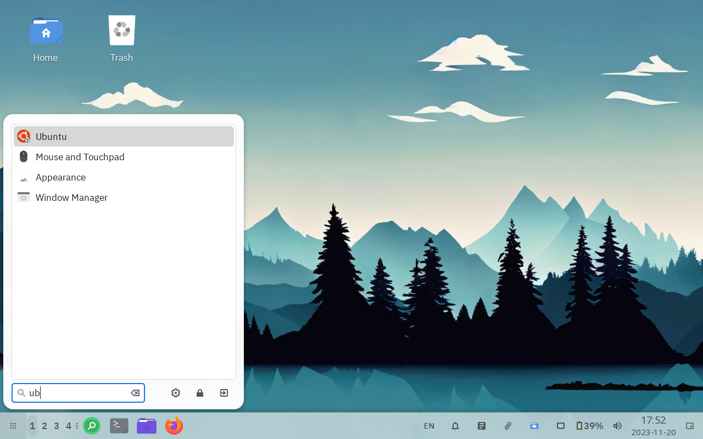
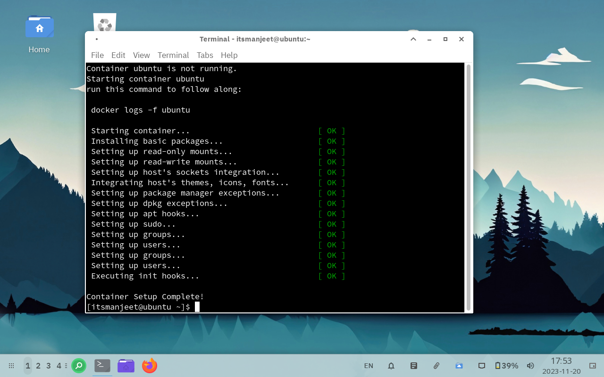

# Containers - Distrobox


**Container** as the name suggested can be visualized as a box isolated from outside environment that holds some specific item. Linux container is that Box from Application the provide a sandbox like environment to safely run an application by restriction the root file system access, hardware and network isolation.

**Distrobox** provide a easy way to create and manage these container using the root file system of other Linux distributions and provide a route to run Application of any Linux distribution on any Linux distribution. Means if there is an application developed specifically for `Ubuntu` still then with the help of distrobox you can run that application on `rlxos GNU/Linux`.


## Setup Distrobox container

We need to type few easy commands to setup distrobox container. Firstly you need to open terminal by either using `Application Finder` or `Ctrl-Alt-T` or `Ctrl-Alt-Space` (for drop-down terminal)

You need to have active internet connection and atleast few GiB bandwidth (depending on the application and distro you select).

### Create new container

To create a container for `Ubuntu` Latest release execute the command below, You can name other distribution like `archlinux`, `debian` or `kalilinux`.

```
$ distrobox create -i ubuntu
```

This command pull the OCI system image of that Linux distribution and Need active internet connection.

### Entering Container

Once you created a new container, You can close that terminal and Search the installed Distribution in `Application Menu`




On the first, Distrobox perform some initial setup to ease the experience, wait until done.




On finish, distrobox drop you inside the container shell, you can verify that with the `PS` which is `<Your Username>@<Your Container Name>`. Here you can execute any command of that container.

### Exporting Container Application

You can export application from container to use them like any other native application using `distrobox-export`

```
$ distrobox-export --app <Application Name>
```