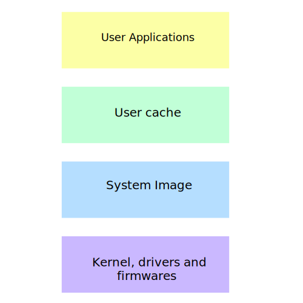
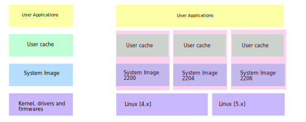

# Architecture

## Layered Architecture

Layered Architecture divides the system into layers one above the other, the top most layer is a read-n-write layer that holds the user changes (or cache data) while the below layers provided different functionalities to the system at different permission levels.

The above diagram represents a very simple representation of layer architecture, or first generation of rlxos layered architecture.

## File system protection

To get a better understanding of the Layered Architecture assume you have to color a flower drawing if you are using permanent colors, and you made a mistake then there is no way back, your drawing is damaged, and you need to redraw it.

So what the other thing you can do ? You can put a transparent sheet on it and fill the colors on that transparent sheet, So if you made any mistake you just need to replace the above sheet.

This is the simplest example for how the rlxos Layered architecture works. All the changes are store in the top layer (i.e. user cache layer). If you made some changes that break the system just replace the cache layer.

## Factory Reset

As in the [File System Protection](#file-system-protection) section we replaced the transparent sheet from the drawing on a mistake. rlxos Factory reset works the same way. You can either load of new cache data or delete the older.

## Multiple Layers

Now suppose you have colored your flower with red. After some time you want to repaint with yellow or pink. Now this can be achieved by simply changing the transparent sheet. and recolor it with different color and that's how the current architecture of rlxos works.

With this you can have different DE or app collections on different profiles.

