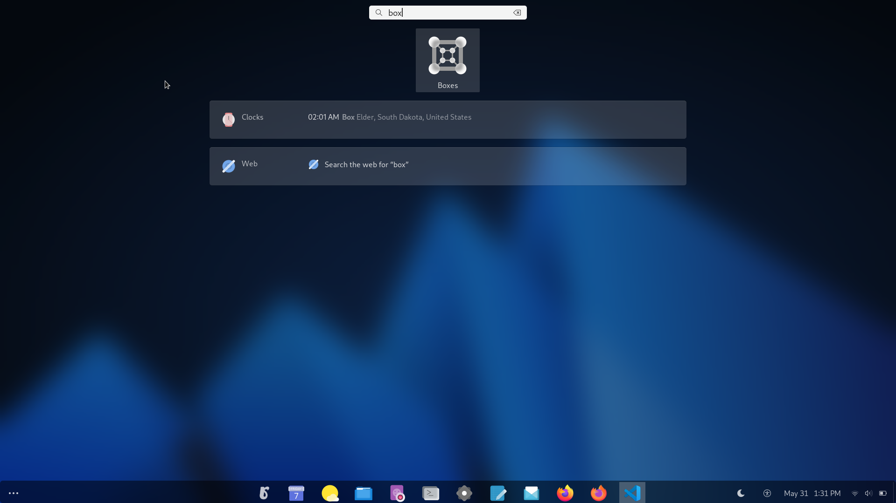
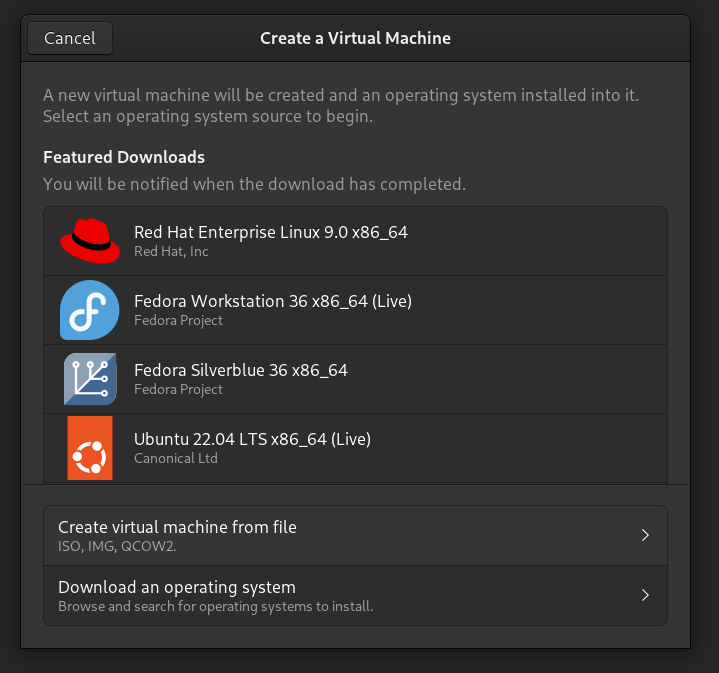
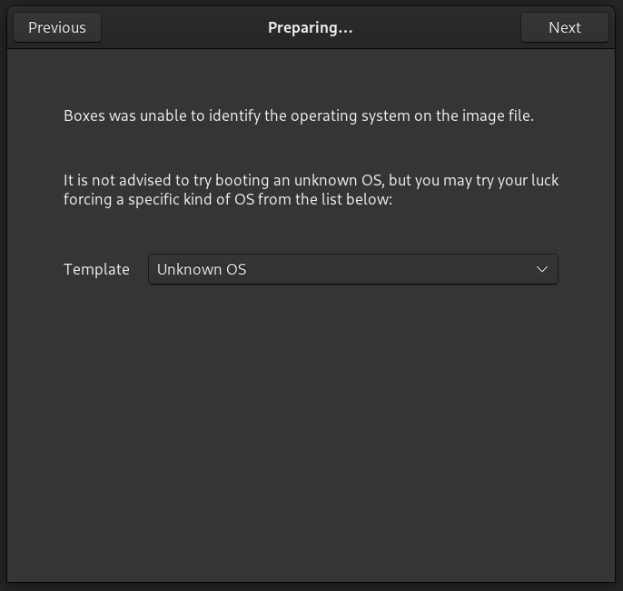

# Gnome Boxes
> A simple GNOME application to view, access, and manage remote and virtual systems.

**GNOME QEMU frontend? (can say)**

Its pretty simple to use, just Install, Select ISO and done.

## Installation
Flatpak method is prefered but you can install it from your package manager (named gnome-boxes)
```
flatpak install org.gnome.Boxes
```

## Run
```
flatpak run org.gnome.Boxes
```

or start it from shell




## Create and Boot into rlxos Box

- You need to select **Create Virtual Machine from file** and the select the rlxos iso



- Use **Unknown OS** as rlxos is *independent* distro.


- And go with the default configurations.


**Now follow the installation and partition GUIDE as it is**