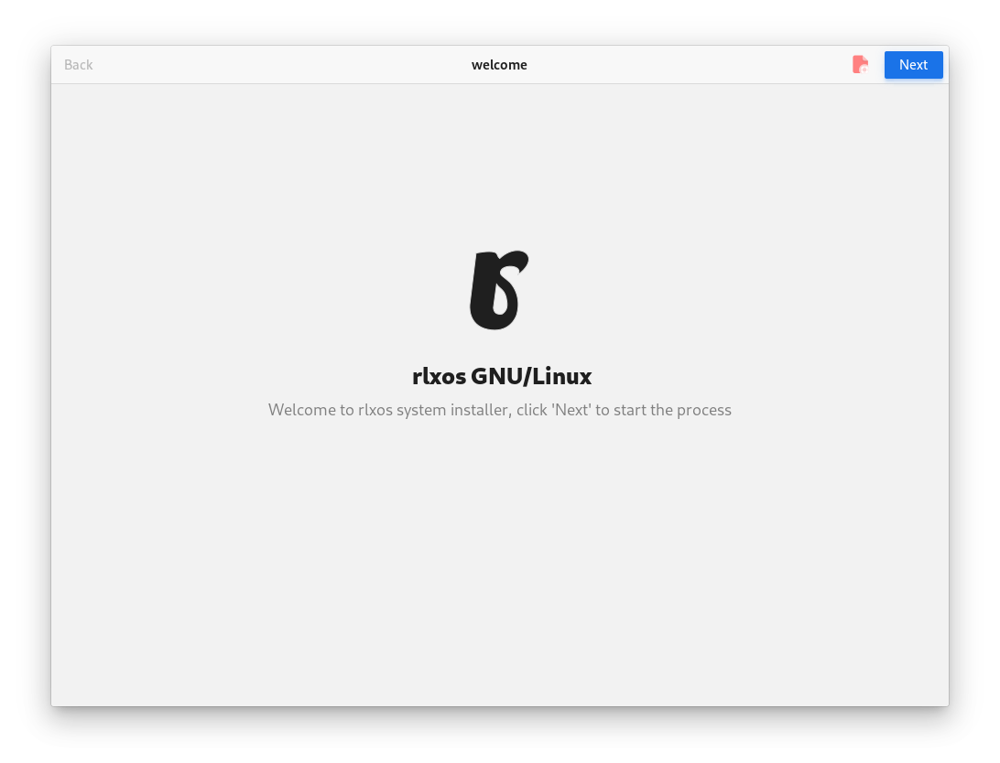
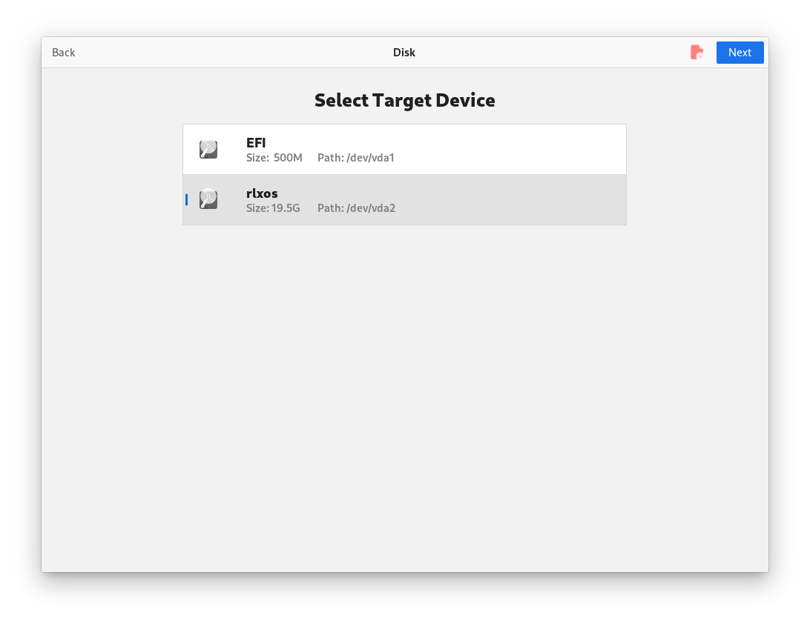
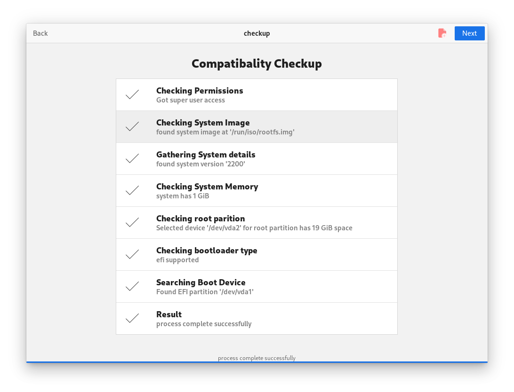
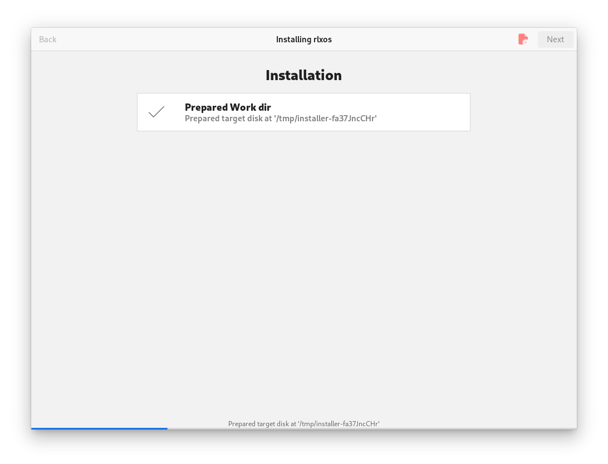
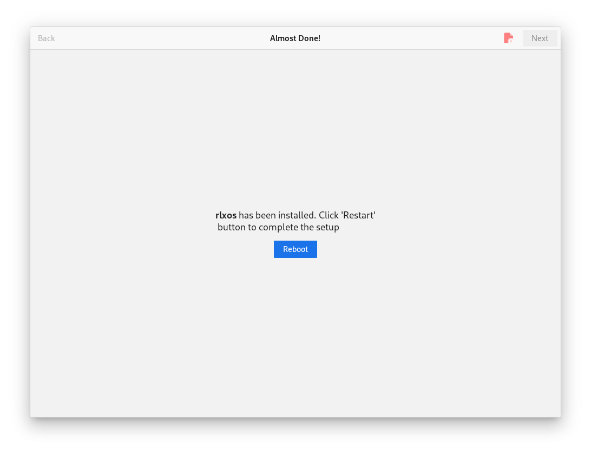

# Installer

Once you are booted into the rlxos live media you will prompt to the System Installer that helps in the installation process.

## Live user
Installation media allows you auto-login as **liveuser** to perform the installation. This account only reside in the installation media so no changes are saved into the installed system.
- Default access password for *liveuser* is **liveuser**
- **liveuser** is a member of **adm** for admin access.
  
## Installation
- Click 'Next' to Start the process, If you have not set up your disk you will prompt to the [gparted](partition.md). You should have a partition layout according to the one specified on the [docs](partition.md#rlxos-partitions-layout).
  
- Once you are done with partitions you need to select the root partition of rlxos

- After that Installer performs the compatibility checkups.

- You need to be 100% sure with the configurations before clicking 'Next' because after that there is no way back.

- If things go right you will be asked to reboot the system after clicking 'Next'

