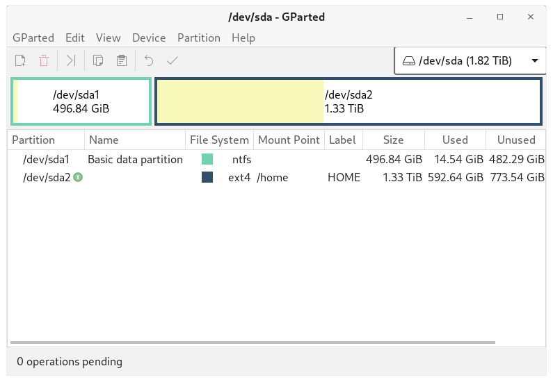

# Partition

Gparted is a GTK frontend to GNU Parted and an official GNOME partition-editing application. GParted is used for creating, deleting, resizing, moving, checking, and copying disk partitions and their file systems

## Gparted

Gparted is a GTK frontend to GNU Parted and an official GNOME partition-editing application. GParted is used for creating, deleting, resizing, moving, checking, and copying disk partitions and their file systems

## Partition Table

If you are using an unallocated disk (in the case of a virtual system) then you need to create a new partition table.

- From Device Menu, Select Create New Partition Table

### rlxos Partitions Layout

Primarily rlxos need only a single partition of at least 10 GiB for a system to boot and work properly.

#### MBR on BIOS

| Partition | Size     | Description                          | Flags | Label (optional) |
| --------- | -------- | ------------------------------------ | ----- | ---------------- |
| root      | >= 10GiB | root parition for rlxos system Image |       | rlxos            |

#### GPT on BIOS

| Partition | Size     | Description                                              | Flags     | Label (optional) |
| --------- | -------- | -------------------------------------------------------- | --------- | ---------------- |
| boot      | >= 1MiB  | A atleast 1MiB partition for bios system with gpt scheme | BIOS boot | EFI              |
| root      | >= 10GiB | root parition for rlxos system Image                     |           | rlxos            |

#### EFI GPT

| Partition | Size      | Description                          | Flags    | Label (optional) |
| --------- | --------- | ------------------------------------ | -------- | ---------------- |
| EFI       | >= 100MiB | EFI partition with format fat32      | boot esp | EFI              |
| root      | >= 10GiB  | root parition for rlxos system Image |          | rlxos            |
