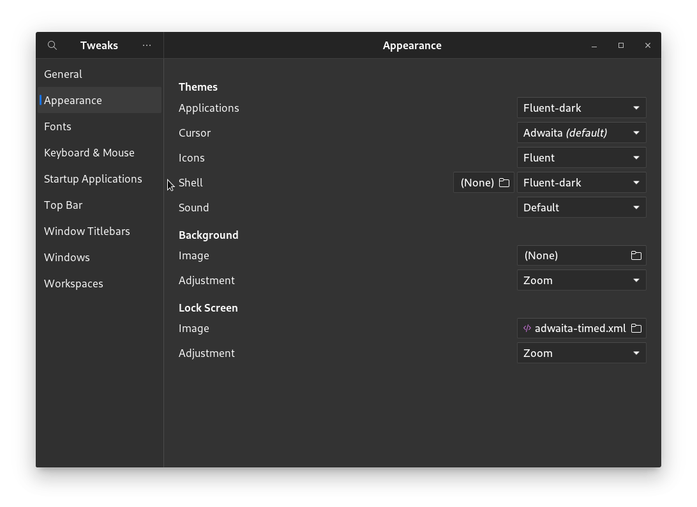
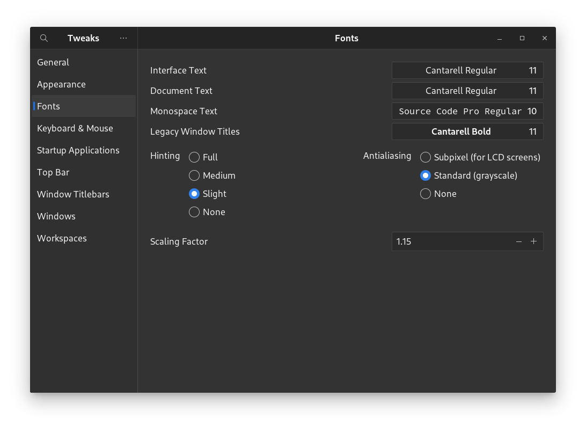

# Customization

You can make rlxos work and look in the way you want.

## Basic Theming - Fonts, Icons, Themes and wallpaper.
Installing new themes, icons and fonts are pretty easy in rlxos.
- Just go to [Bazaar](https://rlxos.dev/apps)
- Look up for fonts, icons, theme in the search or categories
- Download and paste them in ~/Applications directory
- Open the gnome-tweak tool and select your installed item
  

## Extensions
Extension system of GNOME is too great to describe. You can make the system look like Macintosh, windows or any mixture of that.