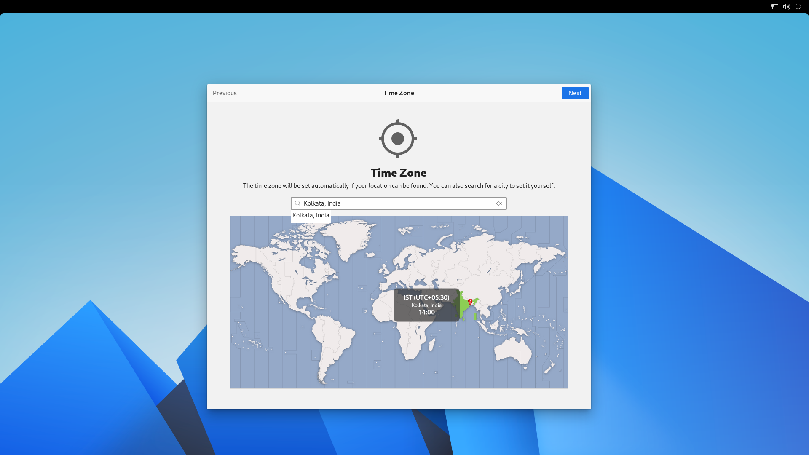
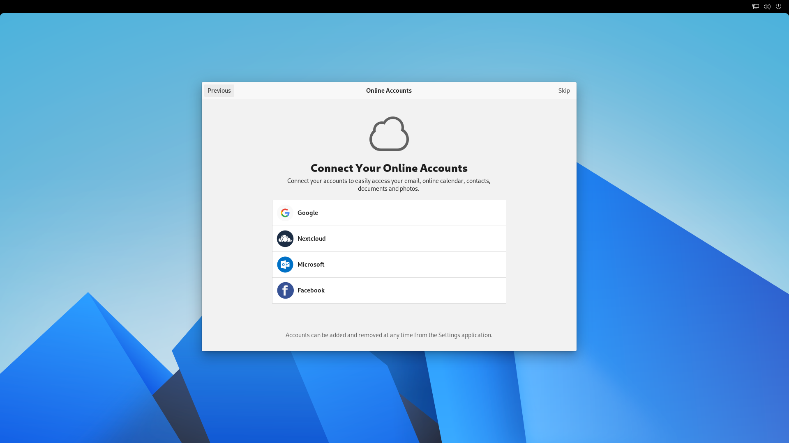
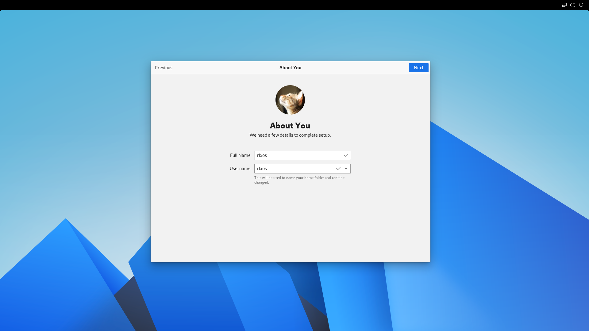
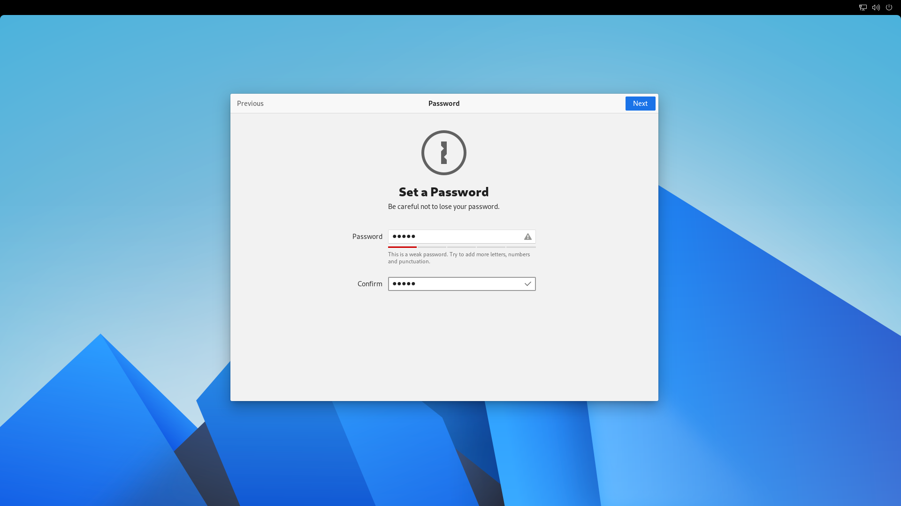
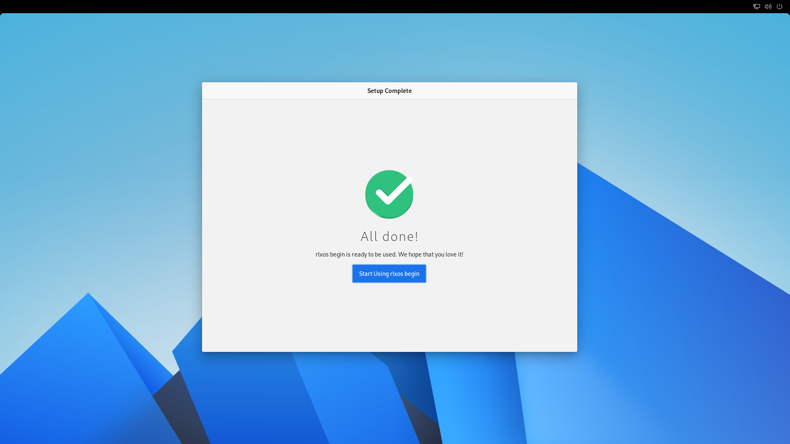

# Initial Setup

The first time a new system is booted is a special situation. There is
no user account yet, and a few basic setup steps need to be performed
before it can be considered fully usable. The initial-setup mode offers a series of steps to

- Select your language
   

- Select your keyboard layout
   

- Configure user privacy

- Set location and timezone

- Configure online accounts

- Create a new user account

- Create password for it

## Finish
