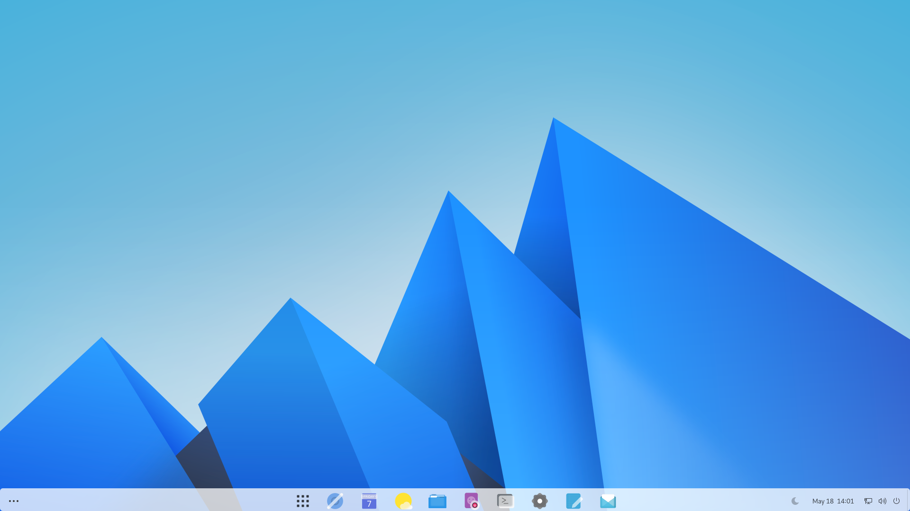
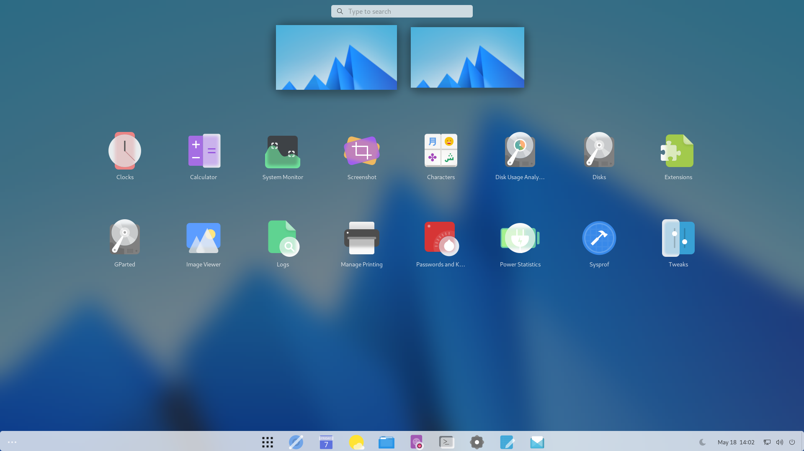
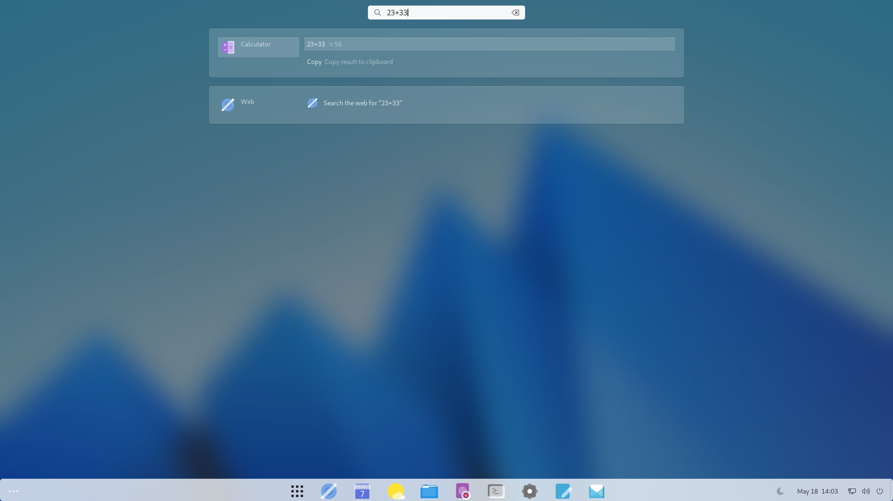
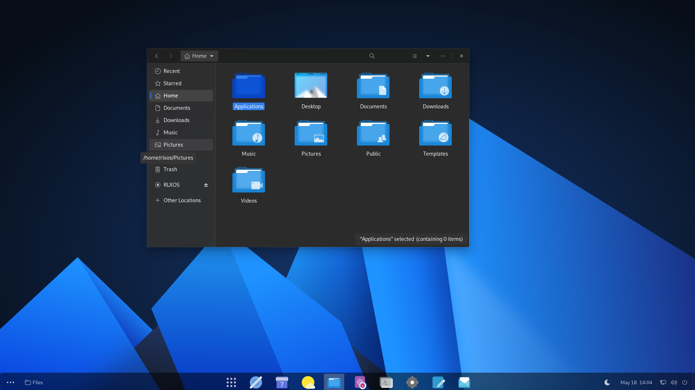

# Interface

## The welcome screen
rlxos provide a traditional interface that feels like home out-of-the-box. A minimal interface with only bottom taskbar that holds your favourite apps, system-tray.

## App menu
Open app-menu by '⌘' (the [super-key](https://en.wikipedia.org/wiki/Super_key_(keyboard_button))) or 'Show-Application' button to view all apps

## Global search
Press '⌘' and start typing your query

## Switch to dark mode
Auto switch to dark mode in night time is supported out-of-the-box. Immediate switch between dark or day mode can be done by using '🌜' from the task bar.

