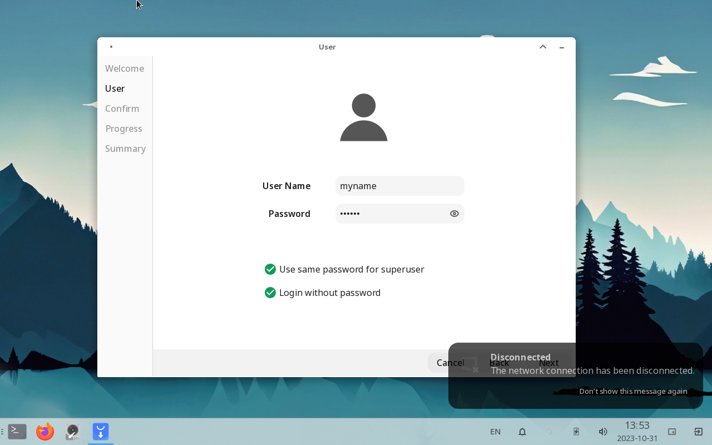
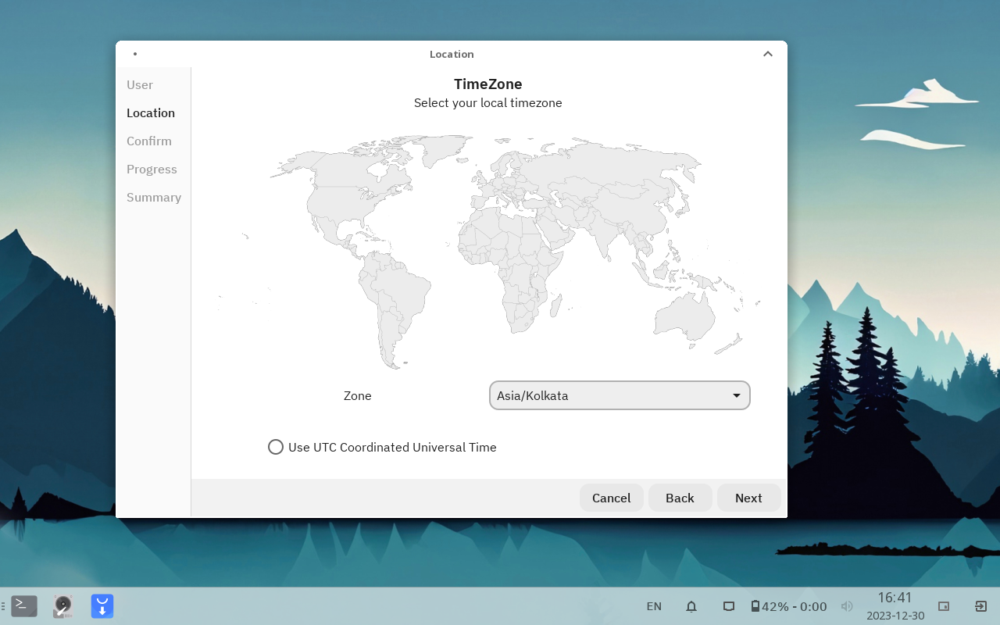
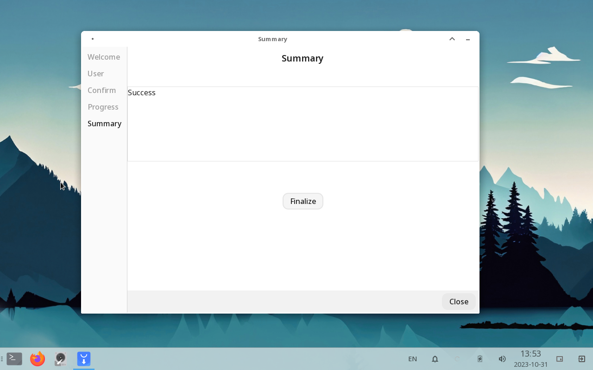

# First Boot

Once you compeleted the installation process you are ready to configure your system. The first boot prompt guide you and
perform the first boot initialization steps Like creating __User account__, __Configure system__ or
__Update Bootloader__.

## Create User Account

You now have to create your local user account that you can use to access your system. Be careful with the password if
you forget, then there is now straight way to access your account. With check button below you can use the same password
to `root` user and Also You can login without entering your password but still you need to remember your password to
perfrom administration tasks.

## Timezone

You can choose your timezone from the alphabetically orderd drop down list or choose the UTC timezone.

Follow the steps prompted to you and wait for the process to finished. Once you finished all the steps you click the *
*Finalize** button the enter your account and use the RLXOS.

