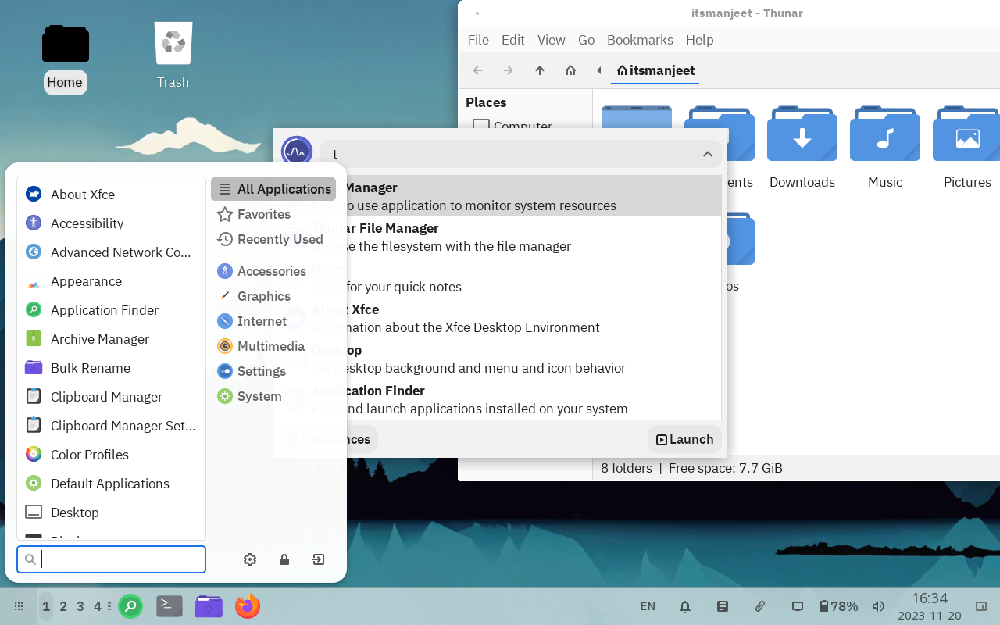
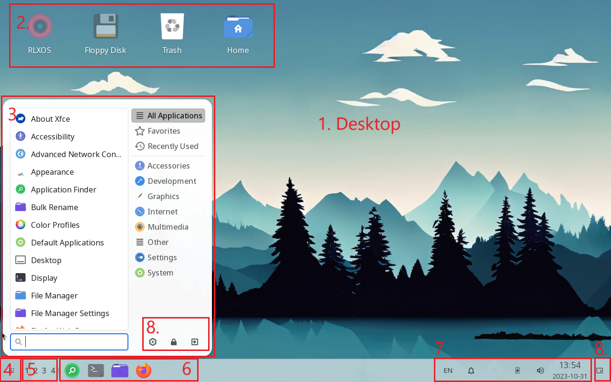
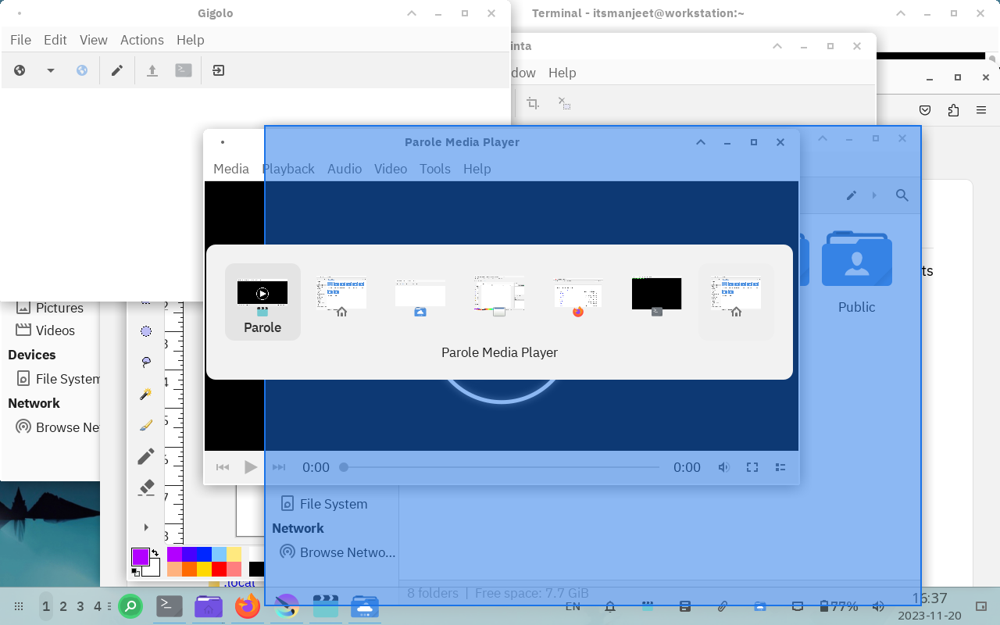
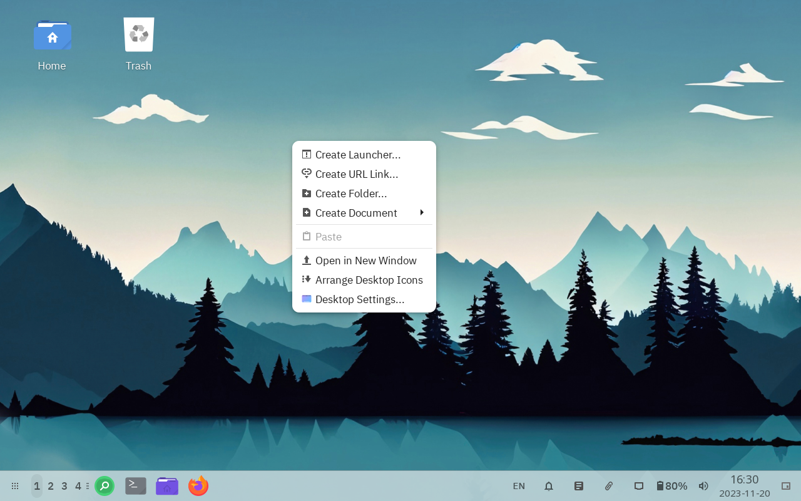
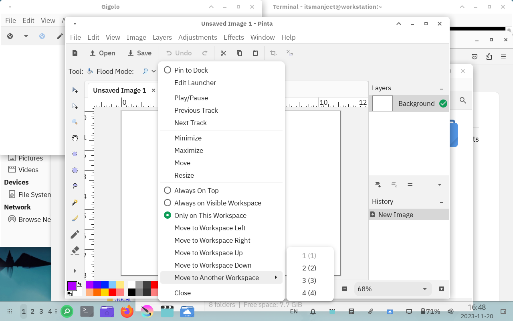
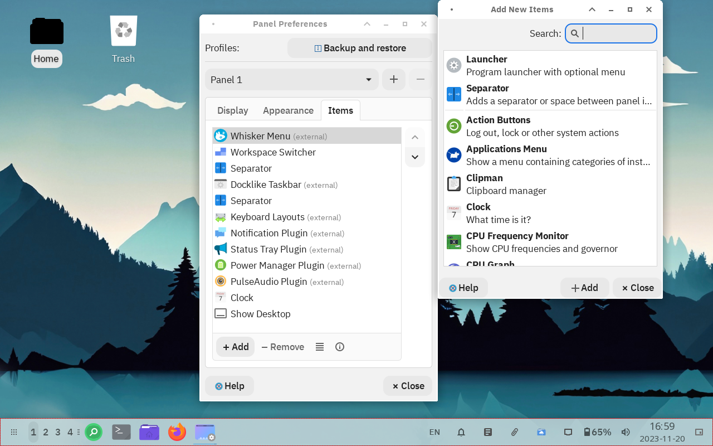
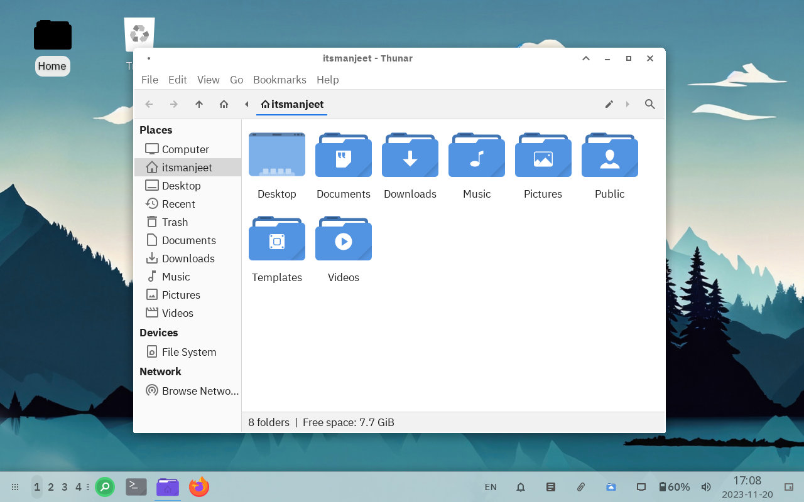
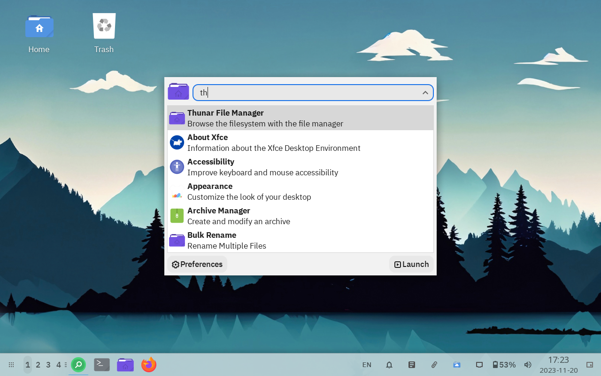

# Welcome Tour

## Interface

RLXOS follows the traditional layout with a single bottom panel and desktop workspace that feels like __HOME__.

On the very left of the panel is the __Application Menu__ from where you can search and launch any of your application. Next to the __Application Menu__ are the workspaces, You can switch to the workspaces to organise your activites, After the there are Pinned application and task bar where your currently running applications are listed. On the right side of panel are __System Tray__ for quick settings.

   
### 1. Desktop Workspace

Areas where you can organize and manage their open applications and windows separately. These workspaces enable multitasking and organization by allowing users to switch between different sets of applications and windows, effectively creating distinct environments for various tasks or workflows.

You can efficiently switch between various tasks by pressing `Alt-Tab`

Or even manage and switch between multiple desktop workspaces using `5. Desktop Workpace Switcher`

### 2. Desktop Icons

Desktop Icons serve as visual cues or quick-access points, allowing users to easily launch applications, access files, or execute specific system tasks by simply clicking on the respective icon. You can create custom icons 

You can `right-click` on `Desktop Workspace` to create custom Desktop Icons 

### 3. Application Menu and 4. Application Button

Application Menu is the place where you can list all your installed application on the left side and view a well organized list on right side. You can Launch the application menu by pression `4. Application Button`

### 5. Desktop Workspace Switcher

You can manage and switch between multiple desktop workspaces using the `Desktop Workspace Switcher`. By default you got 4 Virtual Desktops but you can add, remove and/or rename them as per using requirements by `right-click` on the `Workspace Switcher -> Workspace Settings`

### 6. Taskbar

All the Pinned and Active applications on the active Desktop Workspace are visible on the taskbar, You can Pin, Unpin and/or Move them to different workspace by `right-clicking` on the targeted application Icon.

### 7. System Tray and Plugins

Quick settings and plugins are on the right side of `xfce4-panel` you can interact with various of them by `clicking` or `right-clicking` on them. On the default setup rlxos provides

- **Keyboard switcher**: You can switch between configure languages and set specific keyboard language per application
- **Notification**: To View all system notification.
- **Network Manager**: To Connect and manage your network devices.
- **Power Manager**: View your device power and configuration.
- **Audio Control**: Control your device Input and output audio device.
- **Clock**: Date and time plugin
- **Show Desktop**: Show desktop button hide all application on the active workspace in single click

You can add a plugins already available on your system as per your need from `Settings -> Panel`. From here you can `Add and Remove` one or more than one panels, `Backup and Restore` your panel configurations customize your panel `Appearance` and Add multiple `Items` on the item Tab.

### 8. Application Menu Commands

To `Lock`, `Log Out`, `Switch User` and `ShutDown` you system you can use Application Menu Commands.

## File Manager - Thunar

rlxos (Linux) doesn't have `Local Disks` `C:, D: E:` Like concept. Instead a very simple `Home Directory` mostly users care about, Where you can store your personal files and configurations. 

**Side bar** provide quick access to various locations that you can bookmark by `right-click` on the `Folder` and `Send To -> Side Pane (Add Bookmark)`

**Device** are the List of your Other Storage devices, Like `Removable USB Drive`, `External Storage` and even your `Local Disks C:` and `Local Disks D:`.

### Application Finder

Application Finder is a quick `keyboard`ish way to launch applications. Press `Fn-2`  key to launcher `Application Finder` -> Start typing the Application Name -> Press Enter to Launch.

