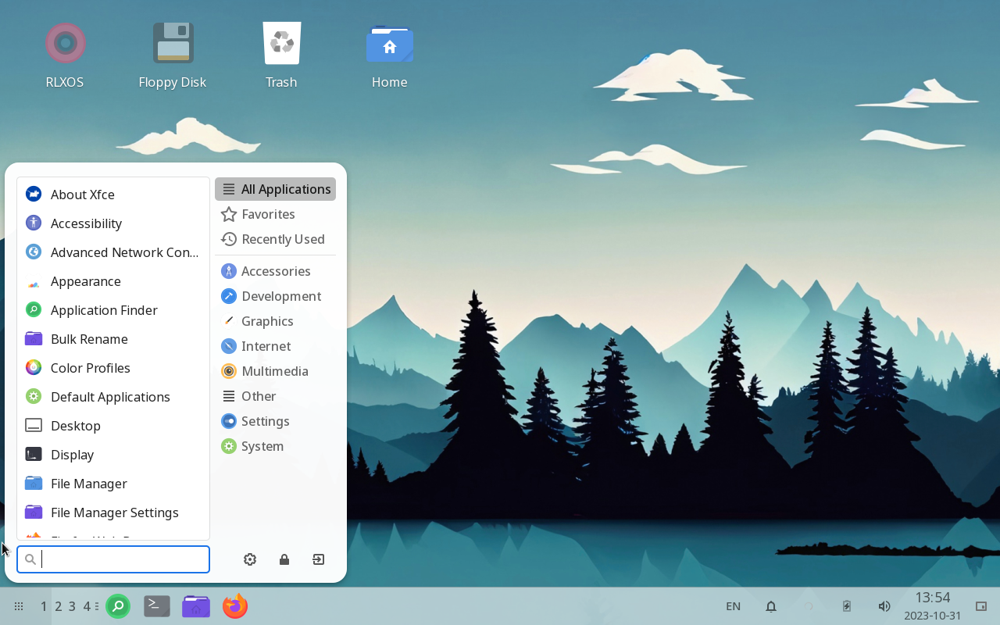

# Welcome Tour

## Interface

RLXOS follows the traditional layout with a single bottom panel and desktop workspace that feels like __HOME__. On the
very left of the panel is the __Application Menu__ from where you can search and launch any of your application. Next to
the __Application Menu__ are the workspaces, You can switch to the workspaces to organise your activites, After the
there are Pinned application and task bar where your currently running applications are listed. On the right side of
panel are __System Tray__ for quick settings.

## Application Finder

